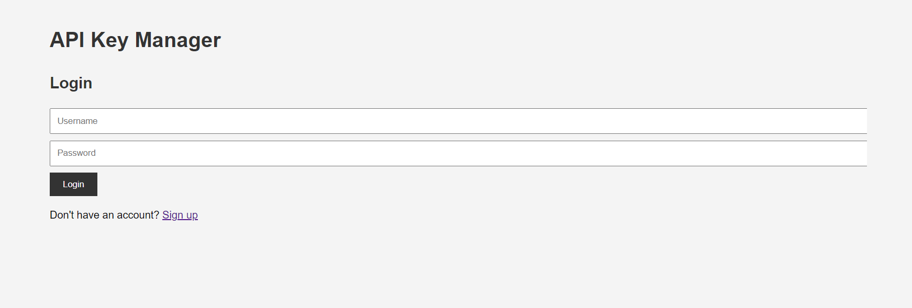
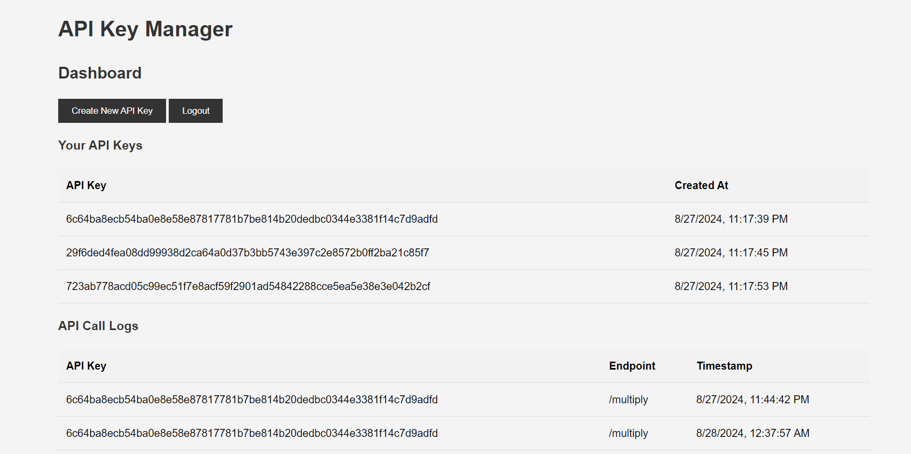

# 🔑 API Key Manager 🔑

This project is an API Key Manager application developed using Node.js, Express, and MongoDB. I created this demo project to practice API creation, handling, and Docker management as part of my web application development training. To maximize your learning, I recommend creating a new project and typing each script yourself. Simply copying and pasting won't be as effective. Just being honest here. 

## 📒 It covers:

* 📝 Sign up and log in.
* 🗝️ Generate API keys.
* 🔍 View their API keys and usage logs.
* ⚙️ Use their API keys to access a sample `/multiply` endpoint.

## 📸 Screenshots 📸

**Login Page:**



**Dashboard:**



## ✨ Features ✨

* **🔒 User Authentication:** Secure user signup and login with password hashing.
* **🔑 API Key Generation:** Generates unique API keys for each user.
* **🗂️ API Key Management:** Users can view and manage their generated API keys.
* **📊 Usage Logs:** Tracks API calls made with each API key.
* **🧪 Sample API Endpoint:** Provides a `/multiply` endpoint that demonstrates API key usage.
* **🐳 Dockerized:** Easy setup and deployment with Docker and Docker Compose.

## 🚀 Getting Started 🚀

### 📋 Prerequisites 📋

* 🐳 Docker
* 🐳 Docker Compose

### ⬇️ Installation ⬇️

1. Clone the repo: `git clone https://github.com/your-username/api-key-manager.git`
2. Navigate to the directory: `cd api-key-manager`
3. Run: `docker-compose up -d`

### ▶️ Usage ▶️

1. Access the app: `http://localhost:3000`.
2. Sign up or log in.
3. Generate API keys and view usage logs on the dashboard.
4. Use your API keys to access the `/multiply` endpoint.

## 💻 API Endpoints 💻

* **`/auth/signup` (POST):** Creates a new user account.
* **`/auth/login` (POST):** Logs in an existing user.
* **`/api/create-api-key` (POST):** Generates a new API key.
* **`/api/user-data` (GET):** Retrieves API keys and usage logs.
* **`/multiply` (POST):** Multiplies two numbers (requires API key).

<details>
  <summary>📂 Project Structure</summary>

```
api-key-manager/
│
├── src/
│   ├── config/
│   │   └── database.js           # 🗄️ Database connection configuration
│   │
│   ├── controllers/
│   │   ├── authController.js     # 💂 User authentication logic
│   │   ├── apiKeyController.js   # 🗝️ API key management logic
│   │   └── multiplyController.js # 🧪 Sample API endpoint logic
│   │
│   ├── middleware/
│   │   └── auth.js               # 💂 Authentication middleware
│   │
│   ├── models/
│   │   └── User.js               # 🧑 User model
│   │
│   ├── routes/
│   │   ├── authRoutes.js         # 🚪 Authentication routes
│   │   ├── apiKeyRoutes.js       # 🗝️ API key management routes
│   │   └── multiplyRoutes.js     # 🧪 Sample API endpoint route
│   │
│   └── app.js                    # ⚙️ Main application file
│
├── public/
│   ├── css/
│   │   └── styles.css            # 🎨 Stylesheets
│   │
│   ├── js/
│   │   └── main.js               # 🖥️ Client-side JavaScript
│   │
│   └── index.html                # 📄 Main HTML file
│
├── .dockerignore
├── .gitignore
├── Dockerfile                    # 🐳 Dockerfile for building the application image
├── docker-compose.yml            # 🐳 Docker Compose configuration
├── package.json                  # 📦 Project dependencies
└── README.md                     # 📄 This file
```

</details>


## 🙌 Contributing 🙌

Contributions are welcome! Please open issues and pull requests.

## 📄 License 📄

This project is licensed under the MIT License.

